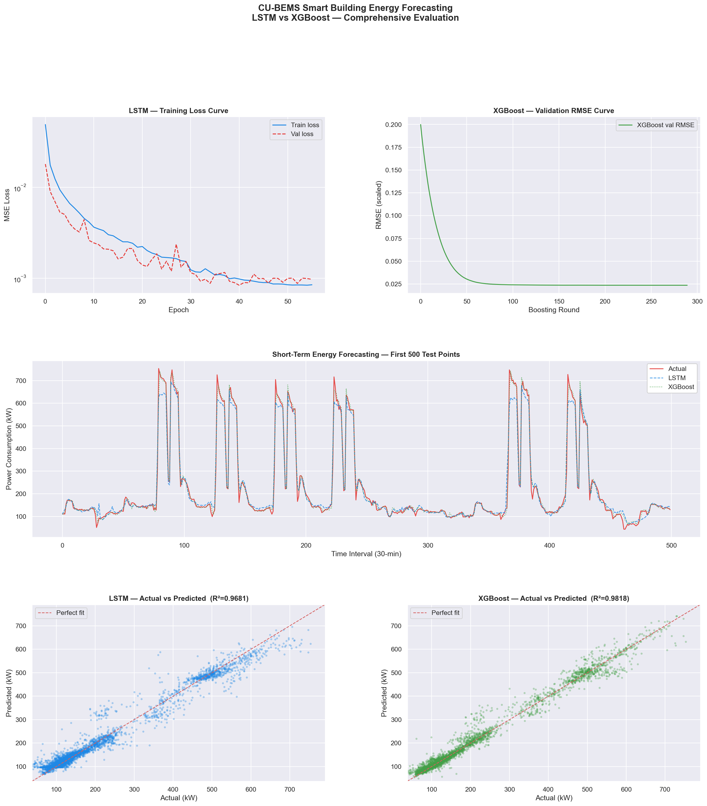
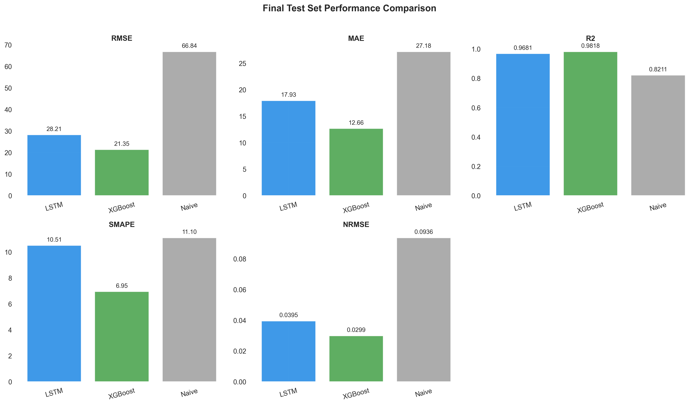
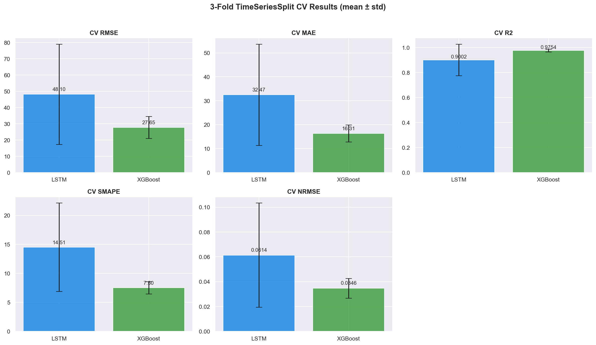
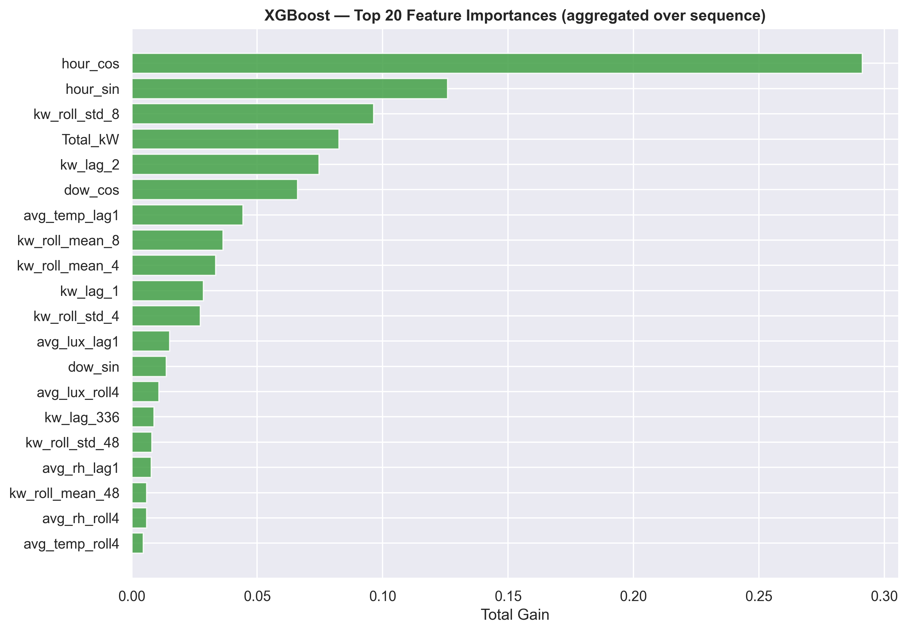
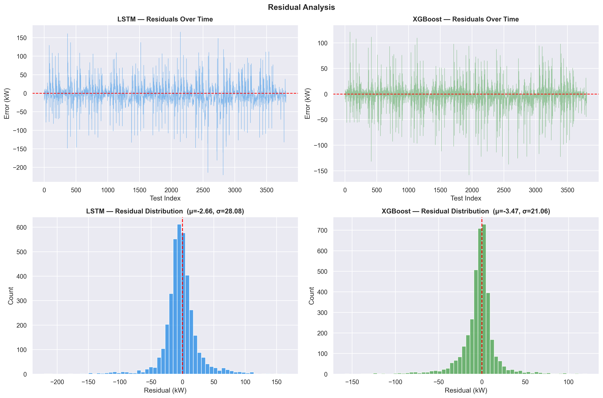

# Comparative Analysis of LSTM and XGBoost for Short-Term Energy Consumption Forecasting in Smart Buildings

[](https://www.python.org/)
[](https://www.tensorflow.org/)
[](https://xgboost.readthedocs.io/)
[](https://scikit-learn.org/)
[](LICENSE.md)

An empirical research study and benchmarking framework comparing deep sequence modeling (**Stacked LSTM**) against a gradient-boosted tree ensemble (**XGBoost**) for short-term whole-building load forecasting using the public **CU-BEMS** smart building dataset.

---

## 📌 Executive Summary

Modern building energy management systems (BEMS) require reliable short-term load forecasting for peak demand shifting and operational planning. While deep learning architectures like LSTM are frequently hypothesized to dominate time-series forecasting, classical gradient-boosted tree models (XGBoost) remain competitive when supplied with domain-specific temporal feature engineering.

This project delivers a **strictly controlled comparative benchmark** under identical preprocessing, feature engineering, and evaluation protocols:
- **XGBoost consistently outperforms LSTM** across every evaluation metric ($R^2$ of **0.9818** vs. **0.9681**; RMSE of **21.35 kW** vs. **28.21 kW**).
- The predictive accuracy advantage was confirmed to be **statistically significant** via the **Diebold-Mariano test** ($p < 0.001$).
- In time-series cross-validation, LSTM demonstrated high performance variance under constrained training sizes, whereas XGBoost remained stable across all folds.
- XGBoost trained **~26× faster** on CPU ($1\text{ min } 44\text{ s}$ vs. $45\text{ min } 16\text{ s}$), showing substantial operational advantages for real-world IoT and edge deployment.

---

## 📊 Key Results

### Final Hold-Out Test Set Performance (15% Split)

| Model | RMSE (kW) ↓ | MAE (kW) ↓ | $R^2$ ↑ | SMAPE (%) ↓ | NRMSE ↓ | MAE Imprv. over Naive | RMSE Imprv. over Naive |
| :--- | :---: | :---: | :---: | :---: | :---: | :---: | :---: |
| **XGBoost** 🏆 | **21.3486** | **12.6593** | **0.9818** | **6.95%** | **0.0299** | **+53.4%** | **+68.1%** |
| **LSTM** | 28.2108 | 17.9291 | 0.9681 | 10.51% | 0.0395 | +34.0% | +57.8% |
| **Naive Persistence** ($t+1 = t$) | 66.8446 | 27.1841 | 0.8211 | 11.10% | 0.0936 | Baseline | Baseline |

### 3-Fold Time-Series Cross-Validation (`TimeSeriesSplit`)

| Metric | LSTM ($\text{Mean} \pm \text{Std}$) | XGBoost ($\text{Mean} \pm \text{Std}$) 🏆 |
| :--- | :---: | :---: |
| **RMSE (kW)** | $48.1040 \pm 30.8295$ | **$27.6479 \pm 6.7840$** |
| **MAE (kW)** | $32.4744 \pm 21.1455$ | **$16.3082 \pm 3.5865$** |
| **$R^2$** | $0.9002 \pm 0.1260$ | **$0.9754 \pm 0.0112$** |
| **SMAPE (%)** | $14.5085\% \pm 7.6215\%$ | **$7.4955\% \pm 1.0452\%$** |
| **NRMSE** | $0.0614 \pm 0.0420$ | **$0.0346 \pm 0.0079$** |

### Statistical Significance (Diebold-Mariano Test)

| Comparison | Loss Criterion | DM Statistic | $p$-value | Significance | Conclusion |
| :--- | :--- | :---: | :---: | :---: | :--- |
| **LSTM vs XGBoost** | MSE (RMSE-equiv.) | $+10.4930$ | $2.06 \times 10^{-25}$ | *** ($p < 0.001$) | **XGBoost significantly more accurate** |
| **LSTM vs XGBoost** | MAD (MAE-equiv.) | $+19.4105$ | $4.17 \times 10^{-80}$ | *** ($p < 0.001$) | **XGBoost significantly more accurate** |
| **LSTM vs Naive** | MSE (RMSE-equiv.) | $-12.3389$ | $2.51 \times 10^{-34}$ | *** ($p < 0.001$) | LSTM significantly outperforms baseline |
| **XGBoost vs Naive** | MSE (RMSE-equiv.) | $-13.4986$ | $1.35 \times 10^{-40}$ | *** ($p < 0.001$) | XGBoost significantly outperforms baseline |

---

## 📈 Visualizations

### 1. Final Forecasting Comparison & Residuals


### 2. Final Test Set Metrics & Cross-Validation Stability
<p align="center">
  
  
</p>

### 3. XGBoost Feature Importance & Residual Distribution
<p align="center">
  
  
</p>

---

## 🔬 Methodology & Pipeline

```
CU-BEMS Raw Data (14 CSVs, 1-min IoT logs, 18 Months)
   │
   ▼
Two-Stage Missing Value Imputation (Linear interp ≤ 60m + Outage thresholding)
   │
   ▼
Building-Level Resampling (30-Minute Interval Sum → Target: Total_kW)
   │
   ▼
Feature Engineering (24 Features: Lags, Rolling Stats, Cyclic Time, IAQ, Flags)
   │
   ├───────────────────────────────┬───────────────────────────────┐
   ▼                               ▼                               ▼
Naive Persistence Baseline   Stacked 3-Layer LSTM        Flattened XGBoost
(t+1 = t)                    (128 → 64 → 32 + Dense)     (2,304 Flattened Inputs)
   │                               │                               │
   └───────────────────────────────┴───────────────────────────────┘
                                   │
                                   ▼
          Evaluation: RMSE, MAE, R², SMAPE, NRMSE & Diebold-Mariano Test
```

### 1. Dataset
- **Benchmark:** [CU-BEMS Dataset](https://www.kaggle.com/datasets/claytonmiller/cubems-smart-building-energy-and-iaq-data) (Chulalongkorn University Building Energy Management System). Originally published in [[1]](#references).
- **Scope:** 7-floor academic office building in Bangkok, Thailand over 18 continuous months (July 1, 2018 – December 31, 2019).
- **Target Variable:** `Total_kW` (30-minute sum of active power loads across all floors, 26,352 records).

### 2. Feature Engineering (24 Predictors)
To eliminate data leakage, rolling and lag features are shifted by at least 1 step ($t-1$):
- **Autoregressive Lags:** `kw_lag_1` (30 min), `kw_lag_2` (1 hr), `kw_lag_48` (24 hr), `kw_lag_336` (1 week).
- **Rolling Load Statistics:** Moving mean and standard deviation over 2-hour, 4-hour, and 24-hour windows.
- **Indoor Air Quality (IAQ):** 1-step lag and 2-hour rolling averages for indoor temperature (°C), relative humidity (RH%), and illuminance (lux).
- **Cyclical Time Encoding:** Sine and cosine transformations for hour of day, day of week, and month of year.
- **Indicators:** Binary flags for weekend (`is_weekend`) and sensor data imputation (`is_iaq_imputed`).

### 3. Model Architectures
- **Stacked LSTM:**
  - Input: 96 timesteps (48 hours) $\times$ 24 features.
  - Layers: Stacked LSTM (128 units) $\rightarrow$ BatchNorm $\rightarrow$ Dropout(0.2) $\rightarrow$ LSTM (64 units) $\rightarrow$ BatchNorm $\rightarrow$ Dropout(0.2) $\rightarrow$ LSTM (32 units) $\rightarrow$ BatchNorm $\rightarrow$ Dropout(0.2) $\rightarrow$ Dense(32) $\rightarrow$ Dense(16) $\rightarrow$ Dense(1).
  - Optimization: Adam ($\text{lr} = 0.001$), Early Stopping ($\text{patience}=15$), ReduceLROnPlateau.
- **XGBoost Regressor:**
  - Input: Flattened temporal sequence ($96 \times 24 = 2,304$ features).
  - Hyperparameters: `n_estimators=1000`, `learning_rate=0.05`, `max_depth=6`, `subsample=0.8`, `colsample_bytree=0.8`, `early_stopping_rounds=50`.

---

## 📁 Repository Structure

```text
.
├── Paper/
│   ├── Comparative Analysis of LSTM and a Traditional Machine Learning Model...docx # Academic research paper       
├── saved_cv/
│   ├── lstm_cv_metrics.csv       # Fold-level cross-validation results for LSTM
│   └── xgb_cv_metrics.csv        # Fold-level cross-validation results for XGBoost
├── saved_fig/
│   ├── building_load_1month.png  # Sample 1-month load profile
│   ├── cv_metrics_barchart.png   # Cross-validation comparison plot
│   ├── feature_importance.png    # Top 20 feature importances (XGBoost)
│   ├── final_metrics_barchart.png# Final test set performance comparison
│   ├── forecasting_comparison.png# Actual vs predicted time series traces
│   ├── iaq_overview.png          # Environmental sensor distributions
│   └── residual_analysis.png     # Error distribution and residual plots
├── saved_models/
│   ├── lstm_final.keras          # Trained weights for final Stacked LSTM model
│   ├── xgb_final.json            # Serialized final XGBoost model
│   ├── scaler_X.pkl              # Feature MinMax scaler
│   └── scaler_y.pkl              # Target MinMax scaler
├── source_code/
│   └── Forecasting_Comparison.ipynb # Complete reproducible Jupyter Notebook
├── .gitignore                    # Git ignore file
└── LICENSE.md                    # MIT License file    
└── README.md                     # Project documentation
```

---

## 🚀 Getting Started

### Prerequisites
- Python 3.10 or 3.11
- Conda or virtualenv (recommended)

### Installation

1. **Clone the repository:**
   ```bash
   git clone https://github.com/ghyoco/Research-Methodology.git
   cd Research-Methodology
   ```

2. **Create and activate an environment:**
   ```bash
   conda create -n energy_forecasting python=3.11 -y
   conda activate energy_forecasting
   ```

3. **Install dependencies:**
   ```bash
   pip install numpy pandas scikit-learn scipy matplotlib seaborn xgboost tensorflow joblib ipykernel
   ```

4. **Launch the Notebook:**
   ```bash
   jupyter notebook source_code/Forecasting_Comparison.ipynb
   ```
   > **Note:** By default, `RETRAIN_LSTM` and `RETRAIN_XGB` in the notebook are set to `False`. The notebook will automatically load the pre-trained weights from `saved_models/` and precomputed metrics from `saved_cv/` to instantly reproduce all tables, statistics, and figures without long training times.

---

## 👥 Authors & Academic Context

This research was conducted as part of the **Research Methodology** curriculum at the **School of Computer Science, Bina Nusantara University (BINUS University)**, Jakarta, Indonesia.

- **Giovanni August Immanuel Wijaya** — Research design, methodology, experimental execution, data analysis, manuscript drafting ([giovanni.wijaya001@binus.ac.id](mailto:giovanni.wijaya001@binus.ac.id))
- **Diana** — Project supervision, methodology review ([diana@binus.edu](mailto:diana@binus.edu))
- **Karel Nathanael Tanoe** — Conceptualization, research design, data validation, manuscript review ([karel.tanoe@binus.ac.id](mailto:karel.tanoe@binus.ac.id))
- **Shania Priccilia** — Project supervision, academic advising, result validation ([shania.priccilia@binus.ac.id](mailto:shania.priccilia@binus.ac.id))

---

## 📚 References

<a id="references"></a>

[1] Pipattanasomporn, M., Chitalia, G., Songsiri, J., Aswakul, C., Pora, W., Suwankawin, S., Audomvongseree, K., & Hoonchareon, N. (2020). CU-BEMS, smart building electricity consumption and indoor environmental sensor datasets. *Scientific Data*, 7(1). https://doi.org/10.1038/s41597-020-00582-3

---

## 📜 License

Everything in this repository is licensed under the MIT License (see 
LICENSE.md), except the contents of /Paper/.

The manuscript in /Paper/ is © 2026 IEEE and is shared under IEEE's author 
self-archiving policy. It is not covered by the MIT license.
